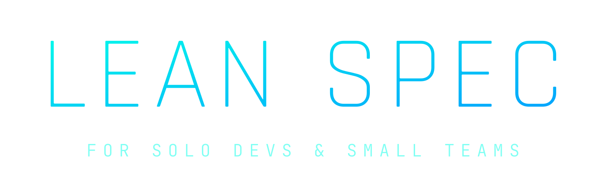

<p align="center">
  
</p>

<h1 align="center">lean-spec v4</h1>

<p align="center"><strong>Deterministic, spec-driven development for Claude Code.</strong><br/>
One phase, one owner, one artifact, one gate — enforced by the harness, not by prompt obedience.</p>

<p align="center"><code>Status: design approved · implementation starting · nothing installable yet</code></p>

---

## What it is

lean-spec is a Claude Code plugin that turns daily software work into a disciplined lifecycle:

```
(first run)   init → plan (interview → PRD + CONSTITUTION)
(per feature) spec → implement (TDD) → review → fix → review → close
```

Every phase is owned by a configured agent (model + effort per phase), produces a mandatory validated artifact, and advances through a state machine the model **cannot bypass** — hooks block direct state edits, artifact gates block empty work, and a verdict gate blocks closing anything a reviewer didn't approve.

## Why v4

v4 is a greenfield rebuild of [lean-spec v3](https://github.com/fadiwahba/lean-spec)'s proven concept on a stricter architecture:

| | v3 | v4 |
|---|---|---|
| Gate logic | bash duplicated across 16 command files | one state CLI (`bin/lean-spec`), hooks own all gates |
| Plugin surface | `commands/` (deprecated) | `skills/` (model-invocable, `/loop`-schedulable) |
| Spec strategy | decompose PRD into all specs upfront | **one spec at a time**, next slice derived from PRD + what's closed |
| Providers | hand-ported command copies (Gemini TOML, OpenCode, Codex) | Claude-only 1.0; external CLIs later as thin headless adapters |
| Config | YAML (no stdlib parser) | **TOML** (`tomllib`, comments) for config · JSON for state |
| TDD | none | default ON — RED/GREEN commits + evidence gate |
| Autonomy | prompt-protocol driver loop | **Stop-hook driver** (deterministic JSON check); `/goal` & `/loop` recipes |

## The three layers

```
bin/lean-spec     MUTATES   — the only writer of workflow.json (ensure/advance/assert/validate/next/status)
hooks/            ENFORCES  — PreToolUse guard · SubagentStop artifact gates · Stop auto-driver
skills/           DESCRIBES — thin prompts that dispatch agents; zero gate logic lives here
```

A skill instruction the model ignores can never corrupt state, because state and gates don't live in skills.

## Agent delegation (defaults)

| Phase | Agent | Model · effort |
|---|---|---|
| plan (interview) | session model | — |
| spec | architect | Opus 4.8 · xhigh |
| implement / fix | coder | Sonnet 5 · high · **TDD** |
| review | reviewer | Opus 4.8 · high (switchable to Sonnet 5) |

All overridable per project in `.lean-spec/rules.toml`:

```toml
[agents]
spec      = { model = "opus",   effort = "xhigh" }
implement = { model = "sonnet", effort = "high" }
review    = { model = "opus",   effort = "high" }

[defaults]
tdd = true
constitution = "docs/CONSTITUTION.md"
```

## Planned command surface (1.0)

```
/lean-spec:init                    scaffold config, docs/, features/ (fail-loud preflight)
/lean-spec:plan "<idea>"           interview → docs/PRD.md + docs/CONSTITUTION.md
/lean-spec:spec                    architect proposes & specs the NEXT slice (or: spec <slug>)
/lean-spec:implement <slug>        coder implements, RED→GREEN TDD (--no-tdd to opt out)
/lean-spec:review <slug>           reviewer → verdict; --visual = Playwright evidence for UI specs
/lean-spec:fix <slug>              NEEDS_FIXES loop
/lean-spec:close <slug>            APPROVE-gated close
/lean-spec:auto <slug>             hands-free: Stop hook drives phases until closed
/lean-spec:auto-all                drain every non-closed feature
/lean-spec:next · status           read-only navigation
```

Autonomy alternatives using Claude Code built-ins (no plugin code involved):

```
/goal features/<slug>/workflow.json has "phase": "closed", or stop after 20 turns
/loop /lean-spec:auto-all
claude -p "/lean-spec:auto <slug>"          # headless / CI
```

## Design principles

- **Fail loudly** — every entry point preflights its environment (python3 ≥ 3.11, Claude Code version floor, git repo) and exits with a one-line actionable error. No silent fallbacks.
- **Artifacts are the audit trail** — `spec.md`, `notes.md` (with TDD evidence), `review.md` (with verdict); `git log` tells the whole story.
- **Zero-config first run** — no `rules.toml` needed to complete a full cycle; every key is additive.
- **Dogfooded** — v4's own features are built through the v4 lifecycle as soon as the pipeline stands.

## Documents

- [`docs/PRD.md`](docs/PRD.md) — **what** we are building: architecture, skill surface, milestones F1–F14, resolved decisions
- [`docs/CONSTITUTION.md`](docs/CONSTITUTION.md) — **how** we build it: stack, invariants, delegation ladder, TDD policy, quality bars

## Roadmap

| Milestone | Scope | Status |
|---|---|---|
| M0 | scaffold, BATS harness, CI | next |
| M1 | state CLI + enforcement hooks | — |
| M2 | lifecycle skills + agents | — |
| M3 | e2e demo, headless CI smoke, marketplace publish, final ship review → **1.0** | — |
| M5 | external provider adapters (Gemini / OpenCode / Codex), telemetry | post-1.0 |

## Requirements

- Claude Code (version floor pinned at F11)
- Python 3 ≥ 3.11 (stdlib only — no pip packages)
- git

---

<p align="center"><sub>lean-spec — for solos & small teams who want their AI agents disciplined.</sub></p>
