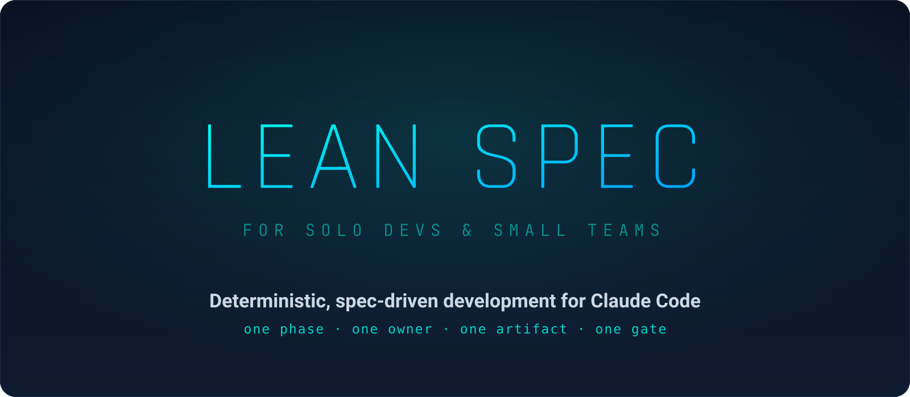

<p align="center">
  
</p>

<p align="center">
  <a href="https://github.com/fadiwahba/lean-spec/actions/workflows/ci.yml"></a>
  
  
</p>

<h1 align="center">lean-spec</h1>

<p align="center"><em>An agent-neutral, deterministic development lifecycle with Claude and Codex adapters.</em></p>

Lean Spec supports macOS and Linux with Python 3.11+, Git, and Bash. Windows
is not a first-class target in this release.

---

## What is lean-spec?

**lean-spec** gives your AI coding agent a rulebook it has to follow.

Instead of asking Claude to "build a feature" and hoping it plans, tests, and reviews along the way, lean-spec runs every feature through a fixed lifecycle:

```
init → plan → spec → implement → review → close
 └ once ┘      └────── repeat per feature ──────┘
```

Each phase has **one owner** (a specific model + effort level), produces **one mandatory artifact** (a validated markdown file), and passes through **one gate** before the next phase can start. The rules aren't polite suggestions in a prompt — they're enforced by the harness: a state machine, file-write guards, and validation hooks that **block** the model when it tries to cut a corner.

The result: a repeatable, auditable trail for every change, where `git log` and the `.lean-spec/features/` folder tell the whole story.

## Why it exists

AI agents are fast but undisciplined. Left to a single prompt, they'll skip the plan, write code before tests, mark their own work "done," and leave you reconstructing what happened. Prompt instructions like *"always write tests first"* fail the moment the model forgets — and a skipped step is a gate that never ran.

lean-spec makes discipline **structural instead of aspirational**:

- **The model can't bypass the process** — phase transitions live in a state CLI and are guarded by hooks, not in prose the model can ignore.
- **The right model does each job** — cheap models code, stronger models spec and review, all configurable per phase.
- **Every step leaves evidence** — a spec, TDD run output, a review verdict — committed as you go.
- **Reviews actually gate** — a feature can't close unless a reviewer (a *different* model than the coder) approves it.

## How it works

Three layers with strictly separated jobs — this is the load-bearing idea:

```
skills/       DESCRIBE   thin prompts that dispatch agents · zero gate logic
hooks/        ENFORCE    block workflow.json edits · gate artifacts · drive auto mode
bin/lean-spec MUTATE     the only thing allowed to write workflow.json
```

A skill instruction the model ignores can never corrupt state, because **state and gates don't live in skills.** Skills just describe work and hand it to an agent; hooks enforce the rules; the CLI is the single source of truth for where each feature is in its lifecycle.

The lifecycle, with its gates:

```
   /lean-spec:spec          architect writes spec.md  ────────┐
        │                   (Scope · ACs · Guardrails)        │ validated
        ▼                                                     │ at every
   /lean-spec:implement     coder writes code + tests         │ SubagentStop
        │                   RED → GREEN, evidence in notes.md │ AND at the
        ▼                                                     │ phase gate
   /lean-spec:review        reviewer writes review.md ────────┤
        │                   verdict: APPROVE│NEEDS_FIXES│BLOCKED
        │                        │
        │   NEEDS_FIXES ──► /lean-spec:fix ──► back to review
        ▼
   /lean-spec:close         refuses unless verdict == APPROVE
```

## Features

- 🔒 **Bypass-proof lifecycle** — hooks block direct state edits and empty artifacts; the model literally can't skip or fake a phase.
- 🎯 **Right model per phase** — spec on Opus, code on Sonnet, review on Opus (or any mix), set in one config file.
- 🧪 **TDD by default** — RED then GREEN, both runs captured as evidence; `review` is blocked without it. Opt out per-feature with `--no-tdd`.
- 📝 **Artifacts as the audit trail** — `spec.md`, `notes.md`, `review.md` per feature; the whole history is in `git log`.
- 🧭 **One spec at a time** — the next slice is derived from the PRD plus what's already shipped, so specs never go stale from being written too early.
- 🖼️ **Visual reviews** — `review --visual` drives the running app with a browser scripted through Bash (e.g. a Playwright CLI script) and captures UI evidence for design specs.
- 🤖 **Hands-free autonomy** — a Stop-hook driver runs a feature (or all of them) to done with no babysitting.
- 💥 **Fail-loud** — every entry point preflights its environment and exits with a one-line, actionable error. No silent fallbacks.
- 🪶 **A dependency-free core** — the harness is pure `python3` stdlib (≥ 3.11) + bash: no Node, no pip, no `jq`/`yq`, no YAML. (Only the optional `review --visual` step reaches for extra tooling — a Playwright CLI, driven through Bash.)

## Getting started

**Install from the marketplace** (recommended) — inside Claude Code:

```
/plugin marketplace add fadiwahba/lean-spec
/plugin install lean-spec@lean-spec
```

**Or run it locally** (for development / trying an unreleased checkout):

```bash
# 1. Get the plugin (clone it anywhere)
git clone https://github.com/fadiwahba/lean-spec.git ~/tools/lean-spec

# 2. From inside YOUR project (any git repo), launch Claude Code with the plugin
cd ~/path/to/your-project
claude --plugin-dir ~/tools/lean-spec
```

Then drive the lifecycle from inside Claude Code:

```
/lean-spec:init                  scaffold .lean-spec/, docs/, .lean-spec/features/, .gitignore  (run once)
/lean-spec:plan "<your idea>"    short interview → .lean-spec/PRD.md + .lean-spec/CONSTITUTION.md
/lean-spec:spec                  architect proposes & specs the NEXT slice
/lean-spec:implement <slug>      coder implements it, RED → GREEN TDD
/lean-spec:review <slug>         reviewer gives a verdict  (--visual for UI specs)
/lean-spec:fix <slug>            address NEEDS_FIXES, loop back to review
/lean-spec:close <slug>          APPROVE-gated — closes the feature
/lean-spec:next · :status        read-only: where am I, what's next
```

### Codex

Use the direct installer from a lean-spec source checkout. Run it once from
the target Git repository:

```bash
python3 /path/to/lean-spec/adapters/codex/install.py --project "$PWD"
```

It installs project-owned runtime files below `.lean-spec/runtime`, skills in
`.agents/skills`, custom agents in `.codex/agents`, hook configuration in
`.codex/hooks.json`, and one marked block in root `AGENTS.md`. It is safe to
run again. Codex discovers the installed skills as `$lean-spec-<name>`.

The repository also contains a Codex plugin. If Lean Spec is available from a
configured marketplace, install it with Codex's `/plugins` browser, start a
new session, then run `$lean-spec-bootstrap` from the target Git repository. Bootstrap
runs the same project installer above. Bootstrap installs project runtime,
custom agents, `AGENTS.md` instructions, hooks, and the canonical lifecycle
skills. Before hooks run, use Codex's `/hooks` screen to review and trust the
project hook definitions.

The installer does not use symlinks. Contributors may use symlinks locally.
Normal project installation uses copied, versioned files.

Optionally override the generated Codex role models in `.lean-spec/rules.toml`:

```toml
[hosts.codex]
spec = { model = "gpt-5.6-sol", effort = "high" }
implement = { model = "gpt-5.6-terra", effort = "medium" }
review = { model = "gpt-5.6-sol", effort = "high" }
```

For headless external-provider dispatch, use the commented examples in
[`examples/rules.toml`](examples/rules.toml). Provider values are stable adapter
IDs (`codex`, `claude`, `gemini`), not company display names.

### Project artifacts and migration

Generated lean-spec artifacts live below `.lean-spec/`: `PRD.md`,
`CONSTITUTION.md`, `features/`, and `auto.json`. To move an older project:

```bash
bin/lean-spec migrate-layout --dry-run
bin/lean-spec migrate-layout
```

`--no-confirm` skips approval of a proposed slice. It never permits the agent
to invent a missing requirement. `bin/lean-spec readiness --no-confirm --json`
returns one `NEEDS_INPUT` question when a preservation, migration, or
regression decision is missing.

lean-spec sends no analytics or telemetry in this release.

Repeat `spec → implement → review → close` for each feature. That's the whole loop.

## Command reference

Every command is a skill invoked as `/lean-spec:<name>` inside Claude Code. Flags are shown in `[brackets]`.

**Setup — run once per project**

| Command | What it does | When to use it |
|---|---|---|
| `/lean-spec:init` | Scaffolds `.lean-spec/rules.toml`, project documents, `.lean-spec/features/`, and `.gitignore`. Preflights the environment (python3 ≥ 3.11, inside a git repo) and fails loud if anything's missing. Idempotent — safe to re-run. | Once, before anything else — in a new **or** existing (brownfield) project. |
| `/lean-spec:plan ["<idea>"] [--refine] [--regenerate]` | Runs a short interview (≤3 rounds) and writes `.lean-spec/PRD.md` + `.lean-spec/CONSTITUTION.md`. Grounds itself in an existing repo's stack/conventions for brownfield. `--refine` folds in one blocker without re-interviewing; `--regenerate` redoes from scratch. | Right after `init`. Use `--refine` when a blocker discovered mid-build needs the plan changed before the next slice. |

**Per-feature lifecycle — repeat for each feature**

| Command | What it does | When to use it |
|---|---|---|
| `/lean-spec:spec [<slug>] [--refine] [--no-confirm]` | The **architect** proposes and writes the next slice's `spec.md` (Scope · Acceptance Criteria · Out of Scope · Coder Guardrails). No slug → derives the next slice from the PRD and what's already closed. `--refine` revises an existing spec; `--no-confirm` skips the proposal confirmation (for unattended runs). | Start of every feature. Preflights that `PRD.md`/`CONSTITUTION.md` are actually filled in first. |
| `/lean-spec:respec <slug>` | Revises an existing `spec.md` in place — an alias for `spec <slug> --refine`. | When a spec needs changing after it's written (scope shift, a blocker refined it). |
| `/lean-spec:implement <slug> [--tdd\|--no-tdd]` | Advances to *implementing*; the **coder** builds the slice RED → GREEN and writes `notes.md` with the captured TDD runs. `--no-tdd` opts out for a spike (recorded per-feature, so the gate honors it). | Once a slice has a spec. |
| `/lean-spec:review <slug> [--visual]` | Advances to *reviewing*; a **reviewer** (a *different* model family than the coder) writes `review.md` with a verdict. `--visual` drives the running app via a Bash-scripted browser and captures UI screenshot evidence for design specs. | After `implement`. |
| `/lean-spec:fix <slug>` | The NEEDS_FIXES loop: sends the feature back to *implementing* (CLI-gated — only allowed when the verdict is `NEEDS_FIXES`), the coder addresses each finding and appends a `## Cycle N` to `notes.md`. | When a review comes back `NEEDS_FIXES`. Then re-run `review`. |
| `/lean-spec:close <slug>` | Advances *reviewing → closed*. Refuses unless the verdict is `APPROVE` — there is no manual override. | When a review is `APPROVE`. |

**Hands-free — optional autonomous drivers**

| Command | What it does | When to use it |
|---|---|---|
| `/lean-spec:auto <slug> [--max-cycles=N]` | Runs the first lifecycle step, then a `Stop` hook drives every remaining phase to `closed` (or `BLOCKED`, or the cycle cap) with no further input. | Drive one already-specced feature to done unattended. |
| `/lean-spec:auto-all [--no-confirm] [--max-features=N]` | Same driver, across every non-closed feature in sequence. `--no-confirm` additionally specs the next slice on demand (one at a time) so a whole small/simple PRD builds from a single command; `--max-features=N` caps how many slices it auto-specs (default 20). | Drain a backlog — or, with `--no-confirm`, spec **and** build a small PRD — hands-free. |

Both `auto` and `auto-all` also accept `--gates-on` — a flag reserved for stricter per-phase confirmation. It's a no-op today (every quality gate is already always-on via the CLI/hooks); it's recorded for forward-compatibility only, so you rarely need it.

Auto state is changed **only** through the state CLI: `bin/lean-spec auto arm <slug> [--chain-all] [--no-confirm] [--gates-on] [--max-cycles=N] [--max-features=N]`, `auto tick --run-id <id> --event-id <id>`, `auto complete --run-id <id> --no-remaining-scope`, and `auto disarm`. `auto tick` is called by the Stop hook; `auto complete` is only for the `NO_REMAINING_SCOPE` sentinel from `auto-all --no-confirm`. `.lean-spec/auto.json` is the CLI's file the way `workflow.json` is `advance`'s. A direct edit is denied by the PreToolUse guard, so starting or restarting an unattended run remains the user's choice. Run `bin/lean-spec auto status [--json]` to inspect a run.

**Read-only — safe any time**

| Command | What it does | When to use it |
|---|---|---|
| `/lean-spec:next [<slug>\|--all]` | Reports the next lifecycle step for a feature (or every feature). Makes no changes. | "What do I run next?" |
| `/lean-spec:status [<slug>]` | Reports the current phase (and, in reviewing, the verdict) for one or all features. Makes no changes. | "Where is everything?" |
| `/lean-spec:help` | Prints this overview — the lifecycle and every skill with when to use it. Makes no changes. | New to lean-spec, or "what can I run?" |

## Configuration

Everything is optional — a zero-config project completes a full cycle. Tune per project in `.lean-spec/rules.toml`:

```toml
[agents]                                              # who runs each phase
spec      = { model = "opus",   effort = "xhigh" }
implement = { model = "sonnet", effort = "high" }
review    = { model = "opus",   effort = "high" }     # switch to "sonnet" to cut cost

[defaults]
tdd = true                                            # RED/GREEN enforced; false or --no-tdd to opt out
required_verdict = "APPROVE"                          # what `close` demands

[required_sections]                                   # additive artifact checks
"spec.md"   = ["Scope", "Acceptance Criteria", "Out of Scope", "Coder Guardrails"]
"review.md" = ["Verdict", "Spec Compliance", "Code Quality"]
```

For an explicit external CLI dispatch, add a provider and an argv-form
authentication check. `lean-spec provider run` runs that check before it
launches the agent command; `provider argv` only prints the safe argv.

```toml
[agents]
implement = { provider = "codex", model = "gpt-5.6-terra", effort = "medium", auth_check = ["codex", "login", "status"] }
```

## Who does what

| Phase | Owner | Default model · effort | Writes |
|---|---|---|---|
| plan | your session | — | `PRD.md`, `CONSTITUTION.md` |
| spec | **architect** | Opus 4.8 · xhigh | `spec.md` |
| implement / fix | **coder** | Sonnet 5 · high · **TDD** | `notes.md` (+ TDD evidence) |
| review | **reviewer** | Opus 4.8 · high | `review.md` (+ verdict) |

By default the coder is reviewed by a *different* model family (Opus reviews Sonnet) — no rubber-stamping your own work. You can downshift the reviewer in `.lean-spec/rules.toml` if you want to trade that for cost.

## Hands-free mode

The `auto` / `auto-all` drivers (see the [command reference](#command-reference)) run the lifecycle unattended. `--no-confirm` turns `auto-all` into a single hands-off command for a small/simple PRD: when nothing is left to drain (mid-run, or on a fresh project with no specs yet) it routes to the host's `spec` skill for the next slice instead of stopping, skipping the per-slice confirmation. Specs are still written strictly one at a time (never batch-decomposed); the architect emits a `NO_REMAINING_SCOPE` sentinel when the PRD is fully covered. Malformed architect output stops with `NEEDS_INPUT`; it never completes the run.

Or use Claude Code built-ins directly — no plugin code involved:

```
/goal .lean-spec/features/<slug>/workflow.json has "phase": "closed", or stop after 20 turns
/loop /lean-spec:auto-all
claude -p "/lean-spec:auto <slug>"          # headless / CI
```

## Try the demo (no API key needed)

See the whole lifecycle run against a throwaway project — real CLI, real hooks, model steps simulated from a fixture so it's fully deterministic:

```bash
./scripts/demo.sh            # needs python3, git, and bash — drives a feature specifying → closed, then shows the gates rejecting a hand-edit and a non-APPROVE close
python3 -m unittest discover -s tests -p 'test_*.py'  # the full suite, incl. the CI-enforced e2e drive
```

Details: [`tests/test_integration.py`](tests/test_integration.py) · [`scripts/demo.sh`](scripts/demo.sh) · [`tests/fixtures/demo-project/`](tests/fixtures/demo-project/).

## Repository documentation

- [`docs/PRD.md`](docs/PRD.md) — **what this repository builds**: architecture, skill surface, milestones, decisions.
- [`docs/CONSTITUTION.md`](docs/CONSTITUTION.md) — **how this repository is built**: stack, invariants, delegation ladder, TDD policy, quality bars.
- [`docs/CODEX_ADAPTER_SPEC.md`](docs/CODEX_ADAPTER_SPEC.md) — Codex adapter contract.

## Roadmap

| Milestone | Scope | Status |
|---|---|---|
| M0 | scaffold · unittest harness · CI | ✅ done |
| M1 | state CLI + enforcement hooks | ✅ done |
| M2 | lifecycle skills + agents | ✅ done |
| M3 | e2e demo ✅ · ship review ✅ · marketplace publish ✅ · headless CI smoke (deferred) → **1.0** | ✅ shipped (1.0, now 1.4.x — see `CHANGELOG.md`) |
| M5 | Codex adapter and explicit CLI provider routing; no telemetry | ✅ done |

## Requirements

- **Claude Code ≥ 2.1.198**
- **Python 3 ≥ 3.11** — stdlib only, no pip packages
- **bash** — the hooks and scripts are bash
- **git**

---

<p align="center"><sub><strong>lean-spec</strong> — for solo devs & small teams who want their AI agents disciplined.</sub></p>
